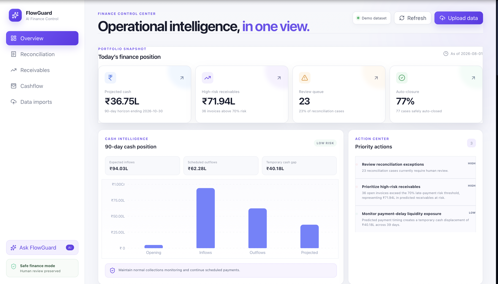
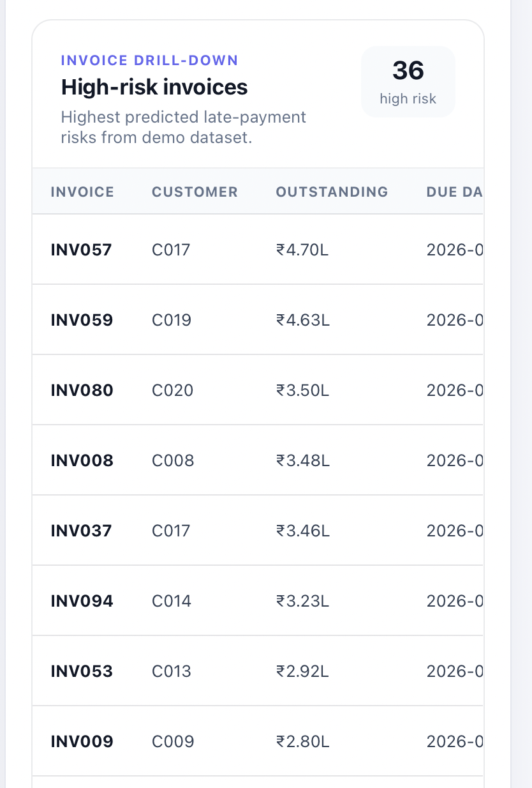
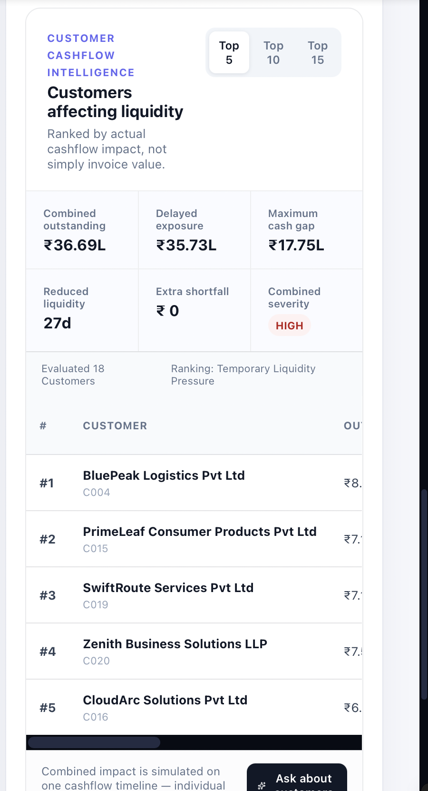

# FlowGuard AI

<p align="center">
  <strong>AI Finance Controller for Reconciliation, Receivables Risk & Cashflow Intelligence</strong>
</p>

<p align="center">
  Built for the <strong>Razorpay AI Buildathon — Track 4: AI Finance Controller</strong>
</p>

---

## Overview

**FlowGuard AI** is an intelligent finance-control platform that helps finance teams move from fragmented financial data to actionable cashflow intelligence.

It combines:

- Automated financial reconciliation
- Payment-delay prediction
- High-risk receivables detection
- Customer-level risk analysis
- Cashflow and liquidity simulation
- Operational CSV ingestion
- Grounded generative AI through **Ask FlowGuard**

The key design principle is simple:

> **The finance engine determines what is true.  
> The AI explains what that truth means.**

FlowGuard does not allow an LLM to independently calculate or invent financial facts. Financial evidence is generated first using deterministic finance logic and prediction services, then supplied to the AI for explanation and decision support.

---

# Problem

Finance teams commonly work across disconnected datasets:

- Payments
- Settlements
- Bank transactions
- Invoices
- Customers
- Refunds
- Chargebacks
- Processing fees
- Adjustments
- Expenses

This creates major operational problems:

- Payment and settlement mismatches require manual investigation.
- Refunds, fees and chargebacks make reconciliation difficult.
- Teams often do not know which receivables are most likely to be delayed.
- A large invoice does not necessarily create the largest liquidity risk.
- Customer payment delays can reduce available cash unexpectedly.
- Traditional dashboards show numbers but do not explain what requires attention.
- Generic AI assistants may produce financial explanations without verified evidence.

---

# Solution

FlowGuard provides a unified **AI Finance Controller** that converts financial records into reconciliation, receivables, customer-risk and cashflow intelligence.

```text
Operational Finance Data
        |
        v
Validation & Normalization
        |
        v
Financial Intelligence Engine
        |
        +--> Reconciliation
        +--> Payment Delay Prediction
        +--> Receivables Analysis
        +--> Customer Risk Analysis
        +--> Cashflow Simulation
        |
        v
Verified Financial Evidence
        |
        +----------------------+
        |                      |
        v                      v
FlowGuard Dashboard      Ask FlowGuard AI
                               |
                               v
                     Evidence & Claim Validation
                               |
                               v
                     Grounded Finance Answer
```

---

# Core Features

## 1. Automated Financial Reconciliation

FlowGuard reconciles information across:

- Payments
- Settlements
- Bank transactions
- Refunds
- Chargebacks
- Fees
- Adjustments

The reconciliation layer can identify:

- Exact matches
- Fuzzy matches
- Refund-adjusted cases
- Fee-adjusted cases
- Chargeback cases
- Unexplained discrepancies
- Transactions requiring manual review

Ambiguous financial cases remain under **human review** rather than being automatically forced into a match.

---

## 2. Payment Delay Prediction

FlowGuard analyzes open invoices and predicts late-payment risk.

For each invoice, the system can provide:

- Invoice ID
- Customer ID
- Invoice amount
- Outstanding amount
- Due date
- Expected payment date
- Expected delay
- Late-payment probability
- Prediction confidence
- Customer payment-history count
- Amount at risk

Predictions are advisory and do not automatically trigger financial actions.

---

## 3. High-Risk Receivables

The dashboard surfaces the invoices most likely to create collection risk.

Finance teams can immediately see:

- High-risk invoice
- Customer
- Outstanding amount
- Due date
- Late-payment probability
- Expected delay
- Prediction confidence

This makes receivables prioritization faster and more transparent.

---

## 4. Customer Risk Intelligence

Invoice predictions are aggregated into customer-level financial intelligence.

For each customer, FlowGuard can calculate:

- Open invoices
- High-risk invoices
- Total outstanding
- Predicted delayed exposure
- Weighted late-payment probability
- Weighted expected delay
- Average prediction confidence
- Maximum temporary cash gap
- Days of reduced liquidity
- Incremental cash shortfall
- Risk severity

This allows finance teams to prioritize customers based on their **actual financial impact**, not simply outstanding invoice value.

---

## 5. Top-N Customer Analysis

The dashboard supports dynamic analysis of:

- Top 5 customers
- Top 10 customers
- Top 15 customers

Customers are ranked according to their liquidity impact.

The dashboard also displays combined metrics such as:

- Combined outstanding
- Combined delayed exposure
- Maximum temporary cash gap
- Reduced-liquidity days
- Incremental cash shortfall
- Combined severity

---

## 6. Combined Cashflow Simulation

A major feature of FlowGuard is that it does **not simply add individual customer cash gaps**.

Instead, selected customers are simulated together on a single company cashflow timeline.

This produces a more realistic measure of combined exposure.

The simulation evaluates:

- Combined outstanding
- Combined delayed exposure
- Weighted expected delay
- Maximum temporary cash gap
- Date of maximum impact
- Days with reduced liquidity
- Baseline minimum balance
- Delayed-payment minimum balance
- Minimum-balance deterioration
- Baseline shortfall
- Delayed-payment shortfall
- Incremental shortfall
- Combined severity

---

# Cash Shortfall vs Liquidity Pressure

FlowGuard distinguishes between two different situations.

### Actual Cash Shortfall

A projected cash balance falls below zero.

### Temporary Liquidity Pressure

Customer delays reduce available cash relative to the expected baseline, but the company remains above zero.

This distinction is important because delayed receivables should not automatically be described as a cash shortage.

---

# Ask FlowGuard AI

**Ask FlowGuard** is the conversational intelligence layer of the platform.

Users can ask questions such as:

```text
What should I prioritize today and why?

Which receivables are highest risk?

Tell me about INV057.

How does C017 affect my cashflow?

Show me the top 10 customers affecting cashflow.

Explain my liquidity exposure.

Why are reconciliation cases under review?
```

The dashboard also provides contextual **Ask** actions beside individual invoices and customers.

---

# Where AI Is Used

FlowGuard deliberately separates **financial calculation** from **AI explanation**.

## AI is used for

- Natural-language financial Q&A
- CFO-level summaries
- Explaining invoice risk
- Explaining customer risk
- Explaining liquidity exposure
- Prioritization
- Decision support
- Converting finance metrics into understandable recommendations

## AI is not used for

- Inventing transaction amounts
- Calculating the source financial truth
- Automatically approving reconciliation cases
- Overriding finance controls
- Modifying accounting records
- Accessing evaluation labels as operational evidence

---

# Grounded AI Pipeline

```text
User Question
      |
      v
Question Routing
      |
      v
Relevant Financial Services
      |
      v
Trusted Evidence
      |
      v
OpenAI LLM
      |
      v
Draft Answer
      |
      v
Evidence Reference Validation
      |
      v
Numeric Claim Validation
      |
      v
Human Review Guardrail
      |
      v
Grounded Final Answer
```

The LLM receives controlled financial evidence rather than unrestricted benchmark or ground-truth information.

---

# AI Safety & Validation

Before an AI response is returned, FlowGuard validates:

- Grounding status
- Evidence references
- Numeric claims
- Unsupported claims
- Benchmark-data isolation
- Human-review preservation

A final system smoke test produced:

```text
Grounded: True
Numbers validated: True
Evidence validated: True
Unsupported claims: 0
Benchmark accessed: False
Human review preserved: True
```

If FlowGuard cannot verify an AI-generated answer safely, it returns a controlled fallback instead of presenting unsupported financial information.

---

# Operational CSV Upload

FlowGuard works with both:

1. The bundled demo dataset
2. User-uploaded operational finance data

## Required CSV Files

```text
customers.csv
invoices.csv
payments.csv
settlements.csv
bank_transactions.csv
expenses.csv
```

## Optional CSV Files

```text
refunds.csv
chargebacks.csv
```

Each upload is normalized into an isolated import workspace.

Uploaded datasets do not overwrite the bundled demo data.

The active dataset is then used consistently across:

- Reconciliation
- Payment-delay prediction
- Receivables intelligence
- Customer analysis
- Cashflow simulation
- Ask FlowGuard AI

---

# Architecture

```text
                      +------------------------+
                      | Operational CSV Data   |
                      +-----------+------------+
                                  |
                                  v
                      +------------------------+
                      | Ingestion & Validation |
                      +-----------+------------+
                                  |
                                  v
                      +------------------------+
                      | Normalized Data Layer  |
                      +-----------+------------+
                                  |
              +-------------------+-------------------+
              |                   |                   |
              v                   v                   v
      +---------------+   +---------------+   +---------------+
      | Reconciliation|   | Delay Predictor|   | Cashflow      |
      | Engine        |   |               |   | Engine        |
      +-------+-------+   +-------+-------+   +-------+-------+
              |                   |                   |
              |                   v                   |
              |           +---------------+           |
              |           | Invoice Risk  |           |
              |           +-------+-------+           |
              |                   |                   |
              |                   v                   |
              |           +---------------+           |
              |           | Customer Risk |           |
              |           +-------+-------+           |
              |                   |                   |
              |                   v                   |
              |           +---------------+           |
              |           | Combined      |           |
              |           | Cashflow      |           |
              |           +-------+-------+           |
              |                   |                   |
              +-------------------+-------------------+
                                  |
                                  v
                     +-------------------------+
                     | CFO Intelligence Layer  |
                     +------------+------------+
                                  |
                  +---------------+---------------+
                  |                               |
                  v                               v
        +------------------+            +------------------+
        | React Dashboard  |            | Trusted Evidence |
        +------------------+            +--------+---------+
                                                |
                                                v
                                      +------------------+
                                      | Ask FlowGuard AI |
                                      +--------+---------+
                                               |
                                               v
                                      +------------------+
                                      | AI Guardrails    |
                                      +------------------+
```

---

# Product Preview

Add screenshots to:

```text
docs/screenshots/
```

Recommended files:

```text
dashboard.png
invoice-risk.png
customer-risk.png
ask-flowguard.png
```

## Finance Dashboard



## High-Risk Receivables



## Customer Liquidity Intelligence



## Ask FlowGuard AI


---

# Technology Stack

## Backend

- Python
- FastAPI
- Pydantic
- Financial reconciliation services
- Payment-delay prediction
- Deterministic cashflow simulation
- Customer liquidity analysis
- OpenAI API
- Pytest

## Frontend

- React
- TypeScript
- Vite
- Recharts
- Lucide React

## Data

- CSV operational datasets
- Isolated normalized imports
- Separate evaluation data

---

# Repository Structure

```text
flowguard-ai/
│
├── backend/
│   └── app/
│       ├── ai/
│       │   ├── dataset.py
│       │   ├── guardrails.py
│       │   ├── openai_provider.py
│       │   ├── question_evidence.py
│       │   ├── routes.py
│       │   └── service.py
│       │
│       ├── api/
│       ├── ingestion/
│       ├── intelligence/
│       │   ├── drilldown.py
│       │   └── drilldown_routes.py
│       │
│       ├── prediction/
│       └── main.py
│
├── data/
│   ├── raw/
│   └── evaluation/
│
├── docs/
│   └── screenshots/
│
├── frontend/
│   └── src/
│       ├── components/
│       ├── lib/
│       ├── App.tsx
│       └── App.css
│
├── ml/
├── reports/
├── tests/
├── requirements.txt
└── README.md
```

---

# Running the Project

## Prerequisites

You need:

- Python 3
- Node.js
- npm
- An OpenAI API key

---

## 1. Clone the Repository

```bash
git clone <YOUR_GITHUB_REPOSITORY_URL>
cd flowguard-ai
```

---

## 2. Backend Setup

Create the Python environment:

```bash
python3 -m venv .venv
source .venv/bin/activate
```

Install dependencies:

```bash
pip install -r requirements.txt
```

---

## 3. Configure OpenAI API

Keep the API key server-side.

On macOS/Linux:

```bash
read -s OPENAI_API_KEY
export OPENAI_API_KEY
echo
```

Verify that it is loaded without printing the secret:

```bash
python -c 'import os; print("API key loaded" if os.getenv("OPENAI_API_KEY") else "API key missing")'
```

Never commit a real OpenAI API key to GitHub.

---

## 4. Start the Backend

```bash
python -m uvicorn backend.app.main:app \
  --host 127.0.0.1 \
  --port 8000 \
  --reload
```

Backend:

```text
http://127.0.0.1:8000
```

FastAPI documentation:

```text
http://127.0.0.1:8000/docs
```

---

## 5. Start the Frontend

Open a second terminal:

```bash
cd frontend
npm install
npm run dev
```

Open the URL shown by Vite.

For example:

```text
http://localhost:5174/
```

The exact port may vary if another local process already uses the default Vite port.

---

# Important API Endpoints

```text
GET  /api/v1/payment-delays

GET  /api/v1/drilldown/customer-risk

POST /api/v1/ai/ask

POST /api/v1/imports

GET  /api/v1/imports/{import_id}

POST /api/v1/imports/{import_id}/analyze

GET  /api/v1/imports/{import_id}/payment-delays
```

The complete current API specification can be explored through FastAPI `/docs`.

---

# Demo Workflow

A reviewer can evaluate FlowGuard with the following sequence:

1. Open the FlowGuard dashboard.
2. Review reconciliation health.
3. Review receivables exposure.
4. Inspect high-risk invoices.
5. Review customers affecting liquidity.
6. Switch between **Top 5**, **Top 10** and **Top 15**.
7. Inspect combined cashflow impact.
8. Click **Ask** beside an invoice.
9. Ask FlowGuard to explain that invoice.
10. Click **Ask** beside a customer.
11. Ask FlowGuard how that customer affects cashflow.
12. Upload operational CSV files.
13. Verify that the dashboard switches to the uploaded dataset.
14. Ask FlowGuard questions about the uploaded financial data.

---

# Example Questions

```text
Which receivables are highest risk?

What should I prioritize today and why?

Tell me about INV057.

How does C017 affect my cashflow?

Show me the top 5 customers affecting cashflow.

Show me the top 10 customers affecting cashflow.

Explain my liquidity exposure.

Why are reconciliation cases under review?
```

---

# Testing & Reliability

The final automated backend test suite passed:

```text
172 passed
```

Additional final validation included:

- Frontend TypeScript production build passed
- Demo invoice prediction API verified
- Demo customer intelligence API verified
- Uploaded-data invoice prediction verified
- Uploaded-data customer intelligence verified
- Ask FlowGuard AI tested successfully
- AI numeric claims validated
- AI evidence references validated
- Unsupported claims = 0 during the final grounding smoke test
- Benchmark data excluded from operational AI reasoning
- Human-review preservation verified
- Git whitespace validation passed
- OpenAI secret scan passed

---

# Final Demo Validation

The bundled demo dataset produced:

```text
Open invoice predictions: 44

Top customer by liquidity impact:
C004

Top-5 combined temporary cash gap:
₹17,75,500

Combined severity:
HIGH
```

These values are demo validation results and are not intended as general real-world performance claims.

---

# Evaluation Data Isolation

Benchmark and ground-truth data are isolated from the operational financial pipeline.

Evaluation labels are not supplied as evidence to Ask FlowGuard AI.

This prevents benchmark information from leaking into operational recommendations or AI explanations.

---

# Financial Safety Principles

FlowGuard follows conservative finance-engineering principles:

- Financial amounts use precise decimal handling.
- Invalid financial values are rejected rather than silently converted to zero.
- Ambiguous reconciliation cases remain under human review.
- Payment predictions remain advisory.
- AI answers must be grounded in verified evidence.
- Numeric claims are validated before answers are returned.
- The LLM cannot override deterministic financial controls.
- Uploaded datasets remain isolated.
- Evaluation data remains isolated from operational reasoning.
- API credentials remain backend-only.

---

# What Makes FlowGuard Different?

FlowGuard is not simply an LLM connected to financial data.

The product separates two responsibilities.

### Financial Truth

Generated through:

- Reconciliation algorithms
- Receivables calculations
- Payment-delay prediction
- Cashflow simulation
- Customer-level aggregation

### Financial Explanation

Generated through:

- Ask FlowGuard AI
- CFO-style summaries
- Natural-language Q&A
- Prioritization
- Decision support

This architecture allows generative AI to improve usability without becoming the source of financial truth.

---

# Business Impact

FlowGuard can help finance teams:

- Reduce manual reconciliation effort
- Detect settlement discrepancies faster
- Identify risky receivables earlier
- Prioritize collections intelligently
- Predict customer payment delays
- Understand customer-level liquidity exposure
- Improve future cash visibility
- Differentiate liquidity pressure from actual cash shortage
- Convert complex finance metrics into understandable explanations
- Preserve human oversight over sensitive financial decisions

---

# Razorpay AI Buildathon

**Track:** Track 4 — AI Finance Controller

FlowGuard addresses the track by combining:

```text
Financial Reconciliation
          +
Receivables Intelligence
          +
Payment Risk Prediction
          +
Customer Cashflow Analysis
          +
Liquidity Intelligence
          +
Grounded Generative AI
```

---

# Current Status

**Demo-ready prototype**

Verified with:

- Bundled demo financial dataset
- Uploaded operational CSV data
- Automated backend tests
- Frontend production build
- OpenAI integration
- Grounded AI validation
- Customer-level cashflow analysis

---

# Future Scope

Potential extensions include:

- Razorpay API integration
- Direct ERP/accounting integrations
- Automated collections workflows
- Scheduled CFO intelligence reports
- Finance alerts through email or Slack
- Advanced anomaly detection
- Treasury forecasting
- Production authentication
- Role-based finance access
- Multi-company workspaces
- Cloud deployment

---

# Disclaimer

FlowGuard AI is a prototype decision-support system developed for the Razorpay AI Buildathon.

Predictive outputs and AI-generated recommendations are advisory and should not replace authorized accounting, finance, audit, compliance or human review.
